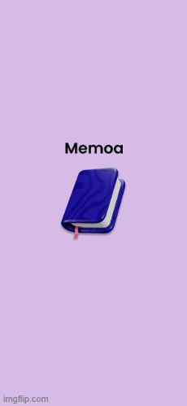

# 📝 Memoa – Notes App

<div align="center">

⚠️ **STILL UNDER DEVELOPMENT** ⚠️

A Flutter-based Notes App designed to help users create, manage, and organize their notes efficiently.  
The project is currently a work in progress, with key features and Firebase integration being implemented gradually.

</div>

---

## 🎨 Design & Prototype

🔴 [▶ View Interactive Prototype](https://www.figma.com/proto/MsamQfcTu5xnPj56wRoMlb/NOTE-PRO-Mobile-App--Community-?node-id=25-8&p=f&t=TsrFovGPeo2FY6EQ-0&scaling=scale-down&content-scaling=fixed&page-id=0%3A1&starting-point-node-id=25%3A8) &nbsp;|&nbsp; 🟣 [Browse Full Design](https://www.figma.com/design/MsamQfcTu5xnPj56wRoMlb/NOTE-PRO-Mobile-App--Community-?node-id=2109-177&t=SQEXwx5kSGXNNvY7-1)

---

## 🎬 App Demo

<div align="center">



</div>

---

## 📱 Screens

### 🔐 Onboarding & Authentication

| Splash Screen | Welcome Screen | Confirm Guest |
|:---:|:---:|:---:|
|  |  |  |

| Sign In | Registration | Forget Password | Create New Password |
|:---:|:---:|:---:|:---:|
|  |  |  |  |

---

### 🏠 Main App

| Home Screen | Sorting Options | Delete Note |
|:---:|:---:|:---:|
|  |  |  |

| Main Text Screen | Choose Category | New Category |
|:---:|:---:|:---:|
|  |  |  |

---

## 🔹 Features (Planned & Partial)

| Status | Feature |
|:---:|---|
| ✅ | User Authentication (Firebase Auth) |
| ✅ | Login with email & password |
| ✅ | Registration (Sign up) |
| ✅ | Guest access option |
| ✅ | Forgot password / Reset password flow |
| ✅ | Create, edit, and delete notes |
| ✅ | Notes categorization (categories/tags) |
| ✅ | Local storage with Hive (for offline persistence) |
| ✅ | Notes listing with basic UI |
| ✅ | Smooth navigation between screens |
| ✅ | Form validation for user inputs |
| 🔜 | Cloud synchronization with Firebase Firestore |

---

## 🛠 Tech Stack

| Technology | Purpose |
|---|---|
|  | Frontend framework |
|  | Programming language |
|  | Local NoSQL storage |
|  | User authentication |
|  | UI components |

---

## ⚡ Getting Started

### 1. Clone the repository

```bash
git clone https://github.com/ABDOU-AHARCHA/NotesApp_Project_flutter2026
cd NotesApp_Project_flutter2026
```

### 2. Install dependencies

```bash
flutter pub get
```

### 3. Initialize Hive (if not done automatically)

```dart
await Hive.initFlutter();
```

### 4. Run the app

```bash
flutter run
```

> Make sure you have a device/emulator running.

---

## 📁 Project Structure

```
lib/
├── models/          # Note & Category models
├── services/        # Auth & Notes manager services
├── screens/         # All app screens
└── main.dart        # App entry point

screenshots/
├── GIF_APP_UI.gif
├── 1 Splash screen.png
├── 2 Welcome screen.png
├── 3 Confirm Guest.png
├── 4 Sign in.png
├── 5 Registration.png
├── 6 Forget Password.png
├── 7 Create new password.png
├── 8 Home screen.png
├── 9 Sorting Option 3.png
├── 10 Delete Note.png
├── 11 Main Text screen.png
├── 12 Choose Category 2.png
└── 13 New Category.png
```

---

## 🚧 Contributing

This project is actively under development. Contributions are welcome, but please check issues and ongoing features before making major changes.

---

## 📌 Notes

- Some features are partially implemented.
- Firebase integration is ongoing.
- UI is still evolving and may change.
- Error handling and testing are in progress.

---

## 👤 Author

**Abdelilah Aharcha** – Flutter Developer

---

## 📄 License

This project is licensed under the [MIT License](LICENSE).

```
MIT License

Copyright (c) 2026 Abdelilah Aharcha

Permission is hereby granted, free of charge, to any person obtaining a copy
of this software and associated documentation files (the "Software"), to deal
in the Software without restriction, including without limitation the rights
to use, copy, modify, merge, publish, distribute, sublicense, and/or sell
copies of the Software, and to permit persons to whom the Software is
furnished to do so, subject to the following conditions:

The above copyright notice and this permission notice shall be included in all
copies or substantial portions of the Software.

THE SOFTWARE IS PROVIDED "AS IS", WITHOUT WARRANTY OF ANY KIND, EXPRESS OR
IMPLIED, INCLUDING BUT NOT LIMITED TO THE WARRANTIES OF MERCHANTABILITY,
FITNESS FOR A PARTICULAR PURPOSE AND NONINFRINGEMENT. IN NO EVENT SHALL THE
AUTHORS OR COPYRIGHT HOLDERS BE LIABLE FOR ANY CLAIM, DAMAGES OR OTHER
LIABILITY, WHETHER IN AN ACTION OF CONTRACT, TORT OR OTHERWISE, ARISING FROM,
OUT OF OR IN CONNECTION WITH THE SOFTWARE OR THE USE OR OTHER DEALINGS IN THE
SOFTWARE.
```
